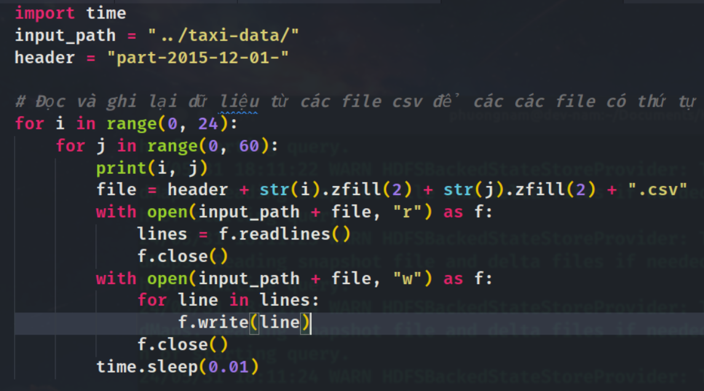

## 1. Chương trình RegenerateTaxiData
- **Nguyên do:** hàm đọc csv files của đổi tượng `DataStreamReader` sẽ đọc các file trong thư mục theo thứ tự của thời gian tạo (modified time) của file. Vì các file ban đầu có thời gian tạo khá lộn xộn ảnh hưởng đến luồng dữ liệu đầu vào của chương trình.
- **Mục đích:** tạo lại các file để thời gian tạo file đúng theo thứ tự tăng dần. Từ đó các file đi vào stream đúng theo thứ tự trong thư mục. Việc này sẽ làm cho dòng dữ liệu đầu vào của chương trình giống như dữ liệu thực tế đang đổ vào.
- **Cách thực hiện:** 
    + Sử dụng cặp i-j với i là giờ, j là phút để đọc tuần tự các file.
    + Viết lại file này ra thư mục
   
- Ngoài ra chương trình còn tạo thêm một file chứa dòng dữ liệu ảo ở ngày 02 tháng 12 để ngắt watermark (sẽ được giải thích ở phần sau).

## 2. Chương trình Task_1_StreamSimulator.py
Cấu trúc (4 phần chính): chương trình được viết dưới dạng class để dễ dàng tái sử dụng trong các task khác.
- Hàm `setup_environment`: tạo các biến môi trường cho chương trình spark.
- Hàm `initialize_spark`: khởi tạo spark session.
- Hàm `define_schema`: định nghĩa schema cho dữ liệu đầu vào.
    - Vì có 2 loại dữ liệu là green và yellow taxi có 2 schema khác nhau nên ta sẽ đưa tất cả các kiểu dữ liệu về StringType.
    - Ngoài ra vì 2 loại dữ liệu này có số cột khác nhau nên ta sẽ lấy số cột tối đa là 22 của green taxi. Các cột bị thiếu của yellow taxi sẽ được đưa về null.
- Hàm `start_streaming`: tạo luồng dữ liệu đọc từ thư mục chứa dữ liệu.
    
    - Hàm `read_stream`: khởi tạo luồng dữ liệu.
    <image src="./images/nam/image copy 2.png" width="700">
        - `option('mode', 'PERMISSIVE')`: dùng để đọc tất cả các dòng dữ liệu không đúng với schema (yellow taxi chỉ có 19 cột).
        - `option('maxFilesPerTrigger', 1)`: số file đọc tối đa trong mỗi trigger
        - `option('latestFirst', 'false')`: đọc file theo thứ tự tăng dần của thời gian tạo file.
    - Hàm `query`: thực hiện các thao tác trên Unbounded Table và xuất ra kết quả
    <image src="./images/nam/image copy 3.png" width="700">
- Output: 
<image src="./images/nam/image copy 5.png" width="700">

## 3. Chương trình Task_2_EventCount
Thực hiện overwriting hàm `query` của chương trình Task_1_StreamSimulator để thực hiện các thao tác trên Unbounded Table và xuất ra kết quả.
<image src="./images/nam/image copy 4.png" width="700">
- Bởi vì chương trình chỉ quan tâm đến sự kiện dựa trên dropoff_datetime nên ta sẽ chỉ lấy cột này để thực hiện các thao tác.
- `watermark("dropoff_datetime", "30 minute")`: đây là phần bắt buôc để luồng dữ liẹu có thể chạy trong thời gian thực. 
    - `30 minute`: là thời gian delay của watermark. Các dòng dữ liệu nằm tới sau với thời gian bé hơn `max event time - delay (watermark)` sẽ bị bỏ qua
    - Các window nằm trong watermark sẽ được giữ lại dưới dạng intermediate state để tiếp tục thực hiện update.
    - Các window nằm ngoài watermark sẽ được xuất ra kết quả dưới dạng append mode.
- Hàm `foreach_batch_function`: dùng để in ra kết quả của từng window đươc realse từ watermark vào folder tương ứng duới dạng json file.
<image src="./images/nam/image copy 6.png" width="700">
- Output từ console: ta có thể thấy một số batch không có dữ liệu do watermark đã giữ lại dữ liệu để chờ thời gian delay trôi qua. Khi window này trượt qua watermark thì dữ liệu sẽ được xuất ra.
<image src="./images/nam/image copy 7.png" width="700">
- Output từ folder: 
<image src="./images/nam/image copy 8.png" width="700">